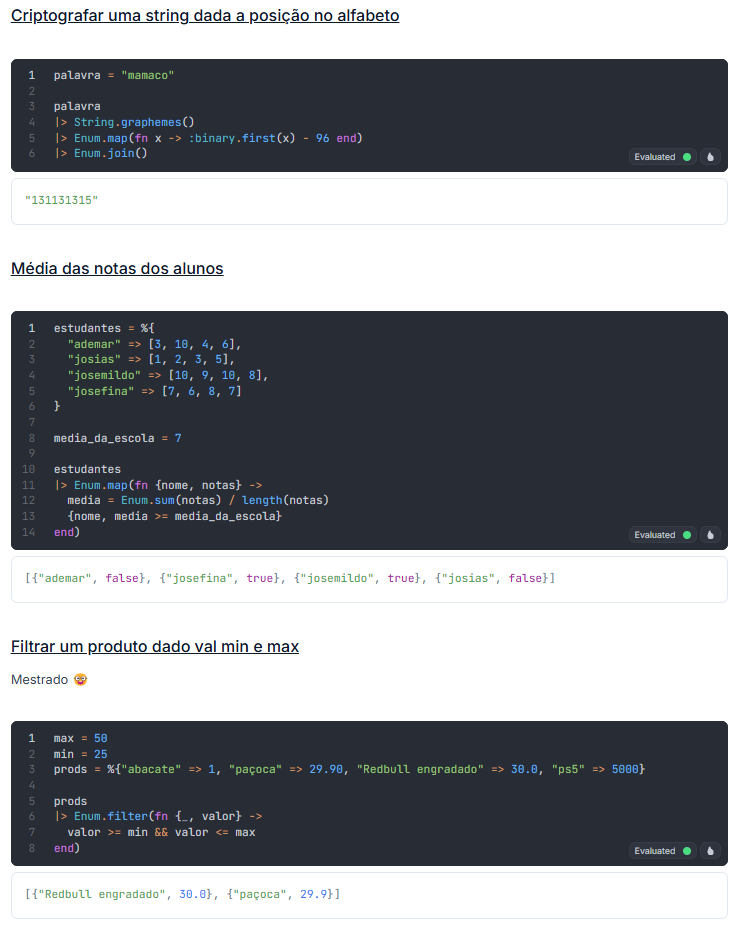

# DesafioCriascript

### Compilado de desafios da série [Desafiando Devs](https://www.youtube.com/watch?v=i4g837mRsHA&list=PLLgKYjEKBqxcIeoikzTNZJtmxjW8eYLM2) do canal [Criascript](https://www.youtube.com/@criascript)

Todos os desafios foram escritos em [Elixir](https://elixir-lang.org/), uma linguagem de programação funcional de alto-nível.

### Como utilizar

1. Instale o [LiveBook](https://livebook.dev/) no seu computador.

* Para Linux, verificar instruções no [Github do projeto](https://github.com/livebook-dev/livebook), é provável que seja necessário instalar o [Elixir](https://elixir-lang.org/) e o [Erlang](https://erlang.org/) via [asdf](https://github.com/asdf-vm/asdf).

2. Execute o LiveBook e abra o arquivo `Criascript.livemd` que está no mesmo diretório deste arquivo.

3. Execute ou crie as células de código para conferir o resultado de cada desafio.

Dicas: Você pode clicar no título de cada desafio para ser redirecionado para o vídeo correspondente.

